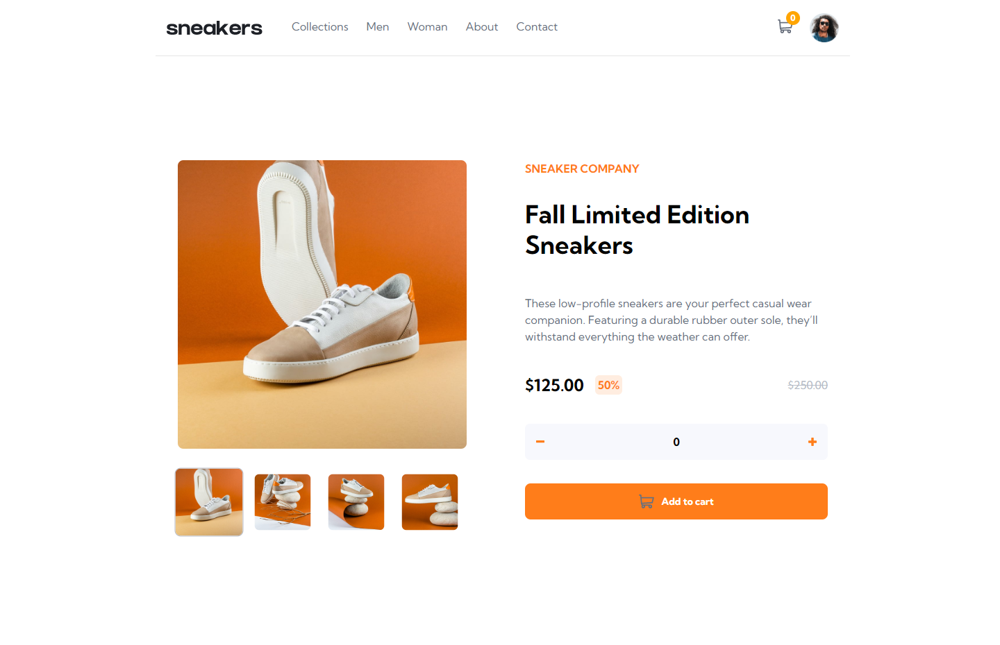

# Frontend Mentor - E-commerce product page solution

 

This is a solution to the [E-commerce product page challenge on Frontend Mentor](https://www.frontendmentor.io/challenges/ecommerce-product-page-UPsZ9MJp6). Frontend Mentor challenges help you improve your coding skills by building realistic projects.

 

### Links

- Live Site URL: [E-commerce product page](https://lucazcruz.github.io/frontend-mentor-challenges/ecommerce-product-page/)

### Built with

- Semantic HTML5 markup
- CSS custom properties
- Flexbox
- CSS Grid
- Mobile-first workflow

## Author

- Frontend Mentor - [@lucazcruz](https://www.frontendmentor.io/profile/lucazcruz)