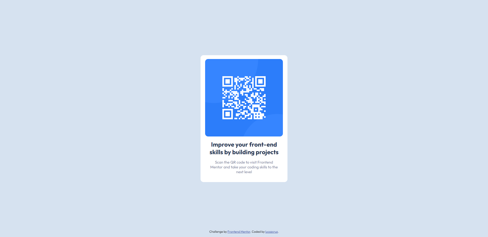

# Frontend Mentor - QR code component solution

 

This is a solution to the [QR code component challenge on Frontend Mentor](https://www.frontendmentor.io/challenges/qr-code-component-iux_sIO_H). Frontend Mentor challenges help you improve your coding skills by building realistic projects. 

 

### Links

- Live Site URL: [Add live site URL here](https://lucazcruz.github.io/frontend-mentor-challenges/qr-code-component-main/)

### Built with

- Semantic HTML5 markup
- CSS custom properties
- CSS Grid

## Author

- Frontend Mentor - [@lucazcruz](https://www.frontendmentor.io/profile/lucazcruz)
